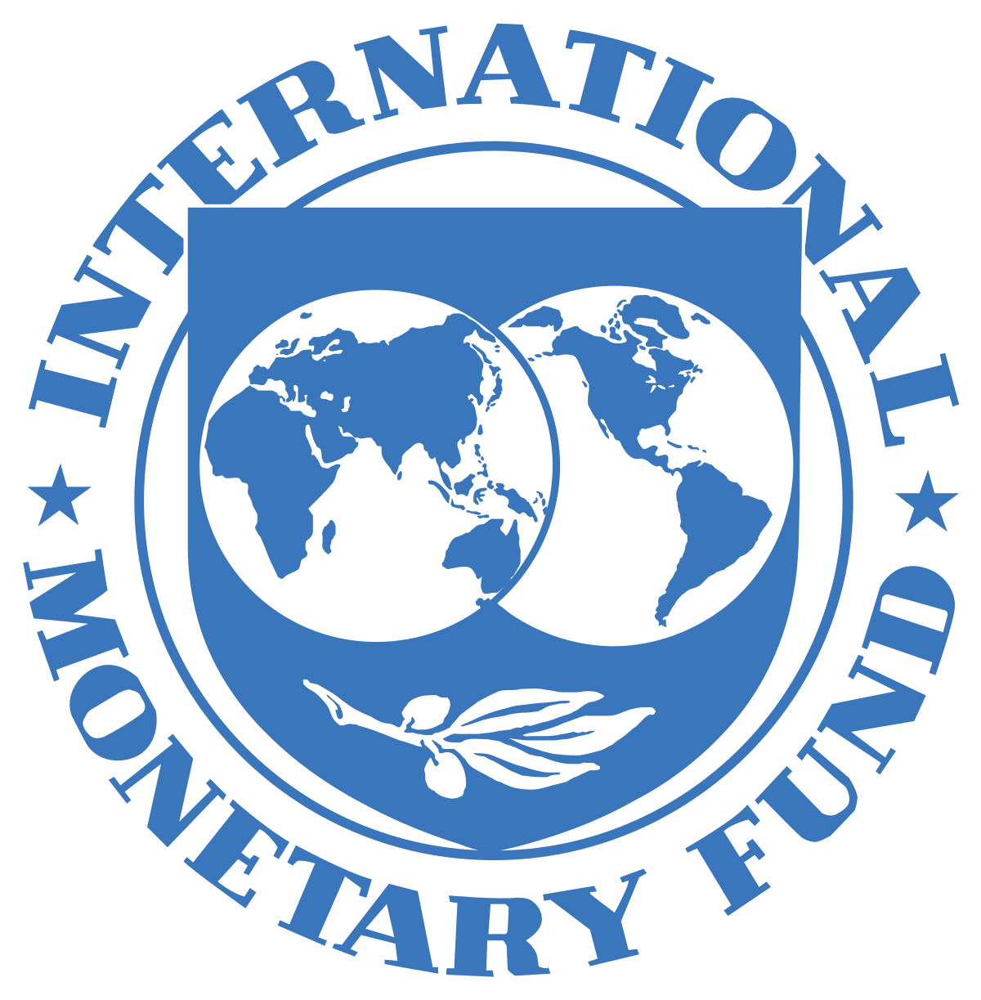

# Vinculación a las API de las principales instituciones económicas
El proyecto fue desarrollado por Mauricio Alvarado y Andrei Romero.

## Objetivo:
El objetivo es vincularse con las API:
1. BCRP
2. YahooFinance
3. IMF
4. FRED
5. WorldBank
6. OCDE

  
  
  
